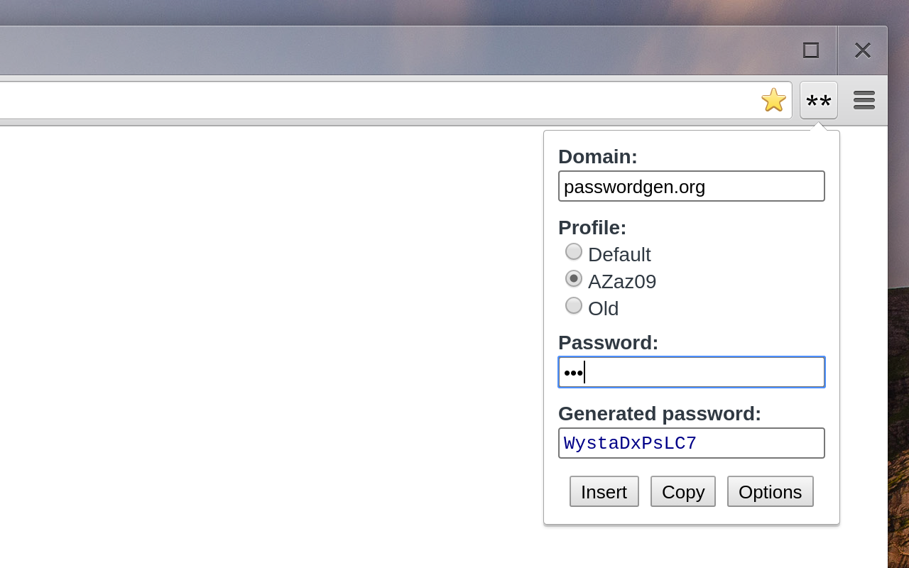
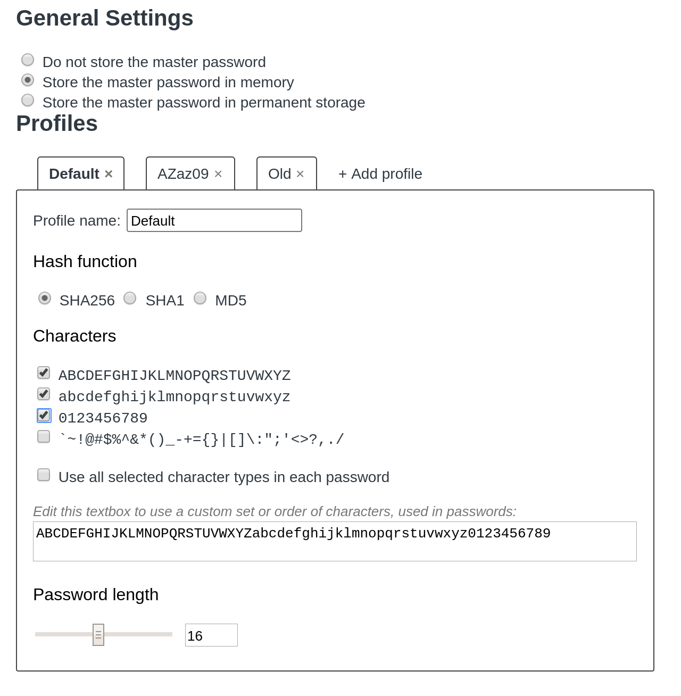

Password Generator
==================

*The online version of Password Generator is now available at <http://passwordgen.org>.*

Chrome extension that generates passwords based on a master password and current domain. Partly (but not completely) compatible with [PasswordMaker](http://passwordmaker.org).

Install extension [from Chrome WebStore](https://chrome.google.com/webstore/detail/password-generator/klfojgipmkdgfmikjfdhhkjlfeboaoij).

The password for each website is generated as a cryptographic hash function from its domain and a master password. Currently MD5, SHA1 and SHA256 are available. When SHA3 is officially released, it will also be added.

The master password can be stored either in memory, in the permanent storage, or not at all. You can have different master passwords for different profiles.

It is possible to ensure that generated passwords contain at least one character from each of several sets (upper/lowercase letters, digits, symbols).

Table of Contents
-----------------
- [Screenshots](#screenshots)
- [Differences from PasswordMaker](#pm)
- [TODO](#todo)

<a name="screenshots">
Screenshots
-----------

Here's the popup used to generate and insert the password into the fields on the page:

And here's the extension options page:

<a name="pm">
Differences from PasswordMaker
------------------------------

Most implementations of [PasswordMaker](http://passwordmaker.org) share common features, so this list of differences applies to all of them. The main goal while developing PasswordGen was to be compatible with PasswordMaker with common settings (generate exactly the same passwords), but sacrifice compatibility in advanced cases in favor of simplicity and more useful features. The differences include:

 - PasswordGen stores all the settings in Chrome sync storage. The settings will be synced across Chrome installations on different computers.

 - PasswordGen groups different characters and makes it possible to ensure that at least one character from each group is present.

 - When "Use all selected character types" option is on, the password still will be the same as in PasswordMaker if it indeed has all character types in it. Otherwise it will be changed.

 - There is no password confirmation in the popup.

 - Master password may be different for each profile. If passwords are stored, then when you enter password for one profile, it will not overwrite passwords for other profiles.

 - There is no HMAC versions of hash functions, since it does not improve security in this use case.

 - Password Generator does rely on username, l33t and so on. The generated password only depends on domain and master password.

 - There are no password prefix and suffix.

 - Password length is limited from 4 to 30.

 - If user edits the domain field in popup, the string that he enters will appear instead of domain next time he generates password on this domain.

<a name="todo">
TODO
----

Add password verification (check password entered in the popup).
